<div align="center">

# 🗂️ FileManagerUniversity

### Безопасный консольный файловый менеджер с комплексной защитой от атак

[](https://www.oracle.com/java/)
[](https://spring.io/projects/spring-boot)
[](https://www.postgresql.org/)
[](LICENSE)

**Профессиональный файловый менеджер с защитой от Path Traversal, ZIP-бомб, XXE и других атак**

</div>

---

## 📋 Оглавление

- [Описание](#-описание)
- [Основные возможности](#-основные-возможности)
- [Технологический стек](#-технологический-стек)
- [Архитектура](#-архитектура)
- [Интерфейс приложения](#-интерфейс-приложения)
- [Безопасность](#-безопасность)
- [Установка и запуск](#-установка-и-запуск)
- [Конфигурация](#-конфигурация)
- [Модель данных](#-модель-данных)
- [Примеры использования](#-примеры-использования)

---

## 🎯 Описание

**FileManagerUniversity** — это консольное приложение для безопасного управления файлами, построенное на Spring Boot. Проект демонстрирует современные подходы к обеспечению безопасности при работе с файловой системой, защищая от широкого спектра атак, включая Path Traversal, ZIP-бомбы, XXE-атаки и атаки типа "Billion Laughs".

### Ключевые особенности

✅ **Комплексная система безопасности** — защита от множества типов атак  
✅ **Аудит операций** — полное логирование всех действий пользователей  
✅ **Работа с архивами** — безопасное создание и извлечение ZIP-архивов  
✅ **Поддержка JSON/XML** — безопасная обработка структурированных данных  
✅ **Информация о системе** — мониторинг дискового пространства  
✅ **Интуитивный интерфейс** — удобное консольное меню  

---

## 🚀 Основные возможности

### 📁 Управление файлами

- ✅ Чтение, создание, изменение и удаление файлов
- ✅ Копирование и перемещение файлов
- ✅ Просмотр содержимого директорий
- ✅ Получение детальной информации о файлах
- ✅ Автоматическое вычисление checksum (SHA-256)

### 📦 Работа с архивами

- ✅ Создание ZIP-архивов из нескольких файлов
- ✅ Безопасное извлечение архивов с защитой от ZIP-бомб
- ✅ Валидация архивов перед извлечением

### 📄 Работа с JSON/XML

- ✅ Чтение и запись JSON файлов
- ✅ Чтение и запись XML файлов
- ✅ Защита от XXE и других XML-атак

### 💾 Информация о системе

- ✅ Просмотр информации о всех дисках
- ✅ Отображение свободного и занятого места
- ✅ Процент использования дисков

### 👤 Управление пользователями

- ✅ Регистрация новых пользователей
- ✅ Аутентификация с хешированием паролей (BCrypt)
- ✅ Разделение файлов по пользователям

---

## 🛠️ Технологический стек

| Технология | Версия | Назначение |
|-----------|--------|------------|
| **Java** | 17+ | Язык программирования |
| **Spring Boot** | 3.5.7 | Основной фреймворк |
| **Spring Data JPA** | 3.5.7 | Работа с базой данных |
| **Spring Security** | 3.5.7 | Безопасность (BCrypt) |
| **PostgreSQL** | 13+ | Реляционная БД |
| **Apache Commons Compress** | 1.28.0 | Работа с ZIP-архивами |
| **Jackson** | - | Обработка JSON/XML |
| **Lombok** | 1.18.36 | Сокращение boilerplate кода |

---

## 🏗️ Архитектура

Проект построен по многослойной архитектуре с четким разделением ответственности:

```
┌─────────────────────────────────────────┐
│     Console Interface (UI Layer)        │
├─────────────────────────────────────────┤
│          Service Layer                  │
│  ┌──────────┬──────────┬───────────┐   │
│  │ File     │ Zip      │ JsonXml   │   │
│  │ Security │ User     │ Disk      │   │
│  │ Audit    │          │           │   │
│  └──────────┴──────────┴───────────┘   │
├─────────────────────────────────────────┤
│        Repository Layer (JPA)           │
│  ┌──────────┬──────────┬───────────┐   │
│  │ File     │ User     │ Operation │   │
│  └──────────┴──────────┴───────────┘   │
├─────────────────────────────────────────┤
│        Entity Layer (JPA)               │
├─────────────────────────────────────────┤
│        PostgreSQL Database              │
└─────────────────────────────────────────┘
```

### Основные компоненты

- **ConsoleInterface** — консольный пользовательский интерфейс
- **FileService** — операции с файлами (CRUD)
- **SecurityService** — валидация путей и проверки безопасности
- **ZipService** — работа с ZIP-архивами
- **JsonXmlService** — обработка JSON/XML с защитой от атак
- **UserService** — управление пользователями и аутентификация
- **AuditService** — логирование всех операций
- **DiskService** — информация о дисках системы

---

## 💻 Интерфейс приложения

### Главное меню


При запуске приложения отображается главное меню с регистрацией или логином.

### Форма регистрации

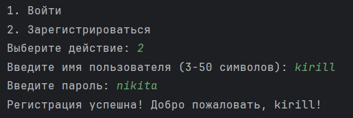

Новые пользователи могут зарегистрироваться, указав имя пользователя и пароль.

### Главное Меню

.jpeg)

Меню предоставляет полный набор операций для управления программой.

### Создание файла

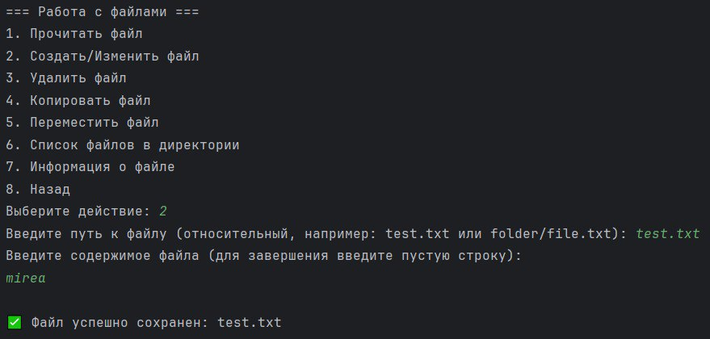

Интуитивный процесс создания и редактирования файлов с вводом содержимого.

### Просмотр содержимого файла

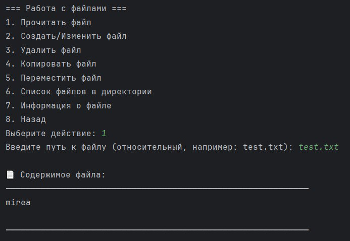

Чтение файлов с красивым форматированием вывода.

### Информация о файле

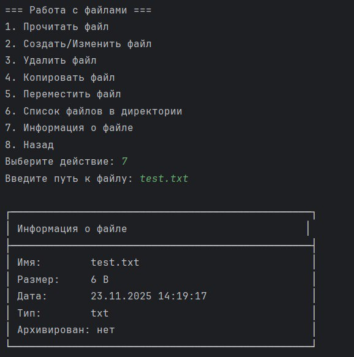

Детальная информация о файле, включая размер, дату создания, тип и checksum.

### Список файлов в директории

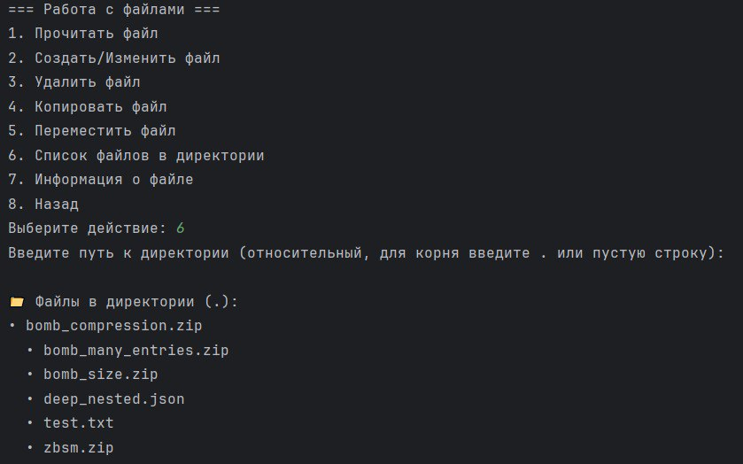

Просмотр всех файлов в выбранной директории с подробной информацией.

### Информация о дисках

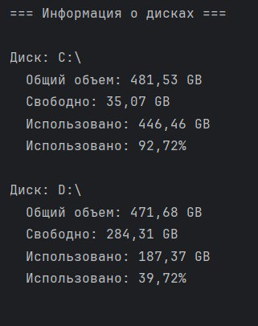

Мониторинг дискового пространства с отображением общей емкости, свободного места и процента использования.

---

## 🔒 Безопасность

Проект реализует комплексную систему защиты от различных типов атак:

### 🛡️ Защита от Path Traversal

Все пути валидируются и нормализуются, чтобы предотвратить доступ к файлам вне базовой директории.

```java
// Проверка, что путь находится внутри базовой директории
if (!resolvedPath.startsWith(basePath)) {
    throw new SecurityException("Path Traversal detected");
}
```

### 💣 Защита от ZIP-бомб

Многоуровневая защита при работе с ZIP-архивами:

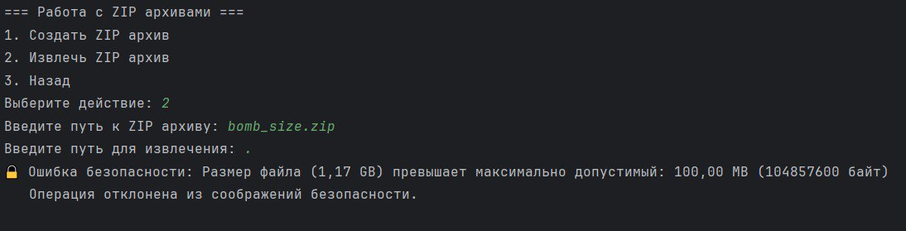

- ✅ Проверка максимального размера распакованных данных (1GB)
- ✅ Проверка степени сжатия (максимум 1:100)
- ✅ Ограничение количества записей (максимум 10,000)
- ✅ Двухпроходная валидация (проверка перед извлечением)
- ✅ Автоматическая очистка при обнаружении угрозы

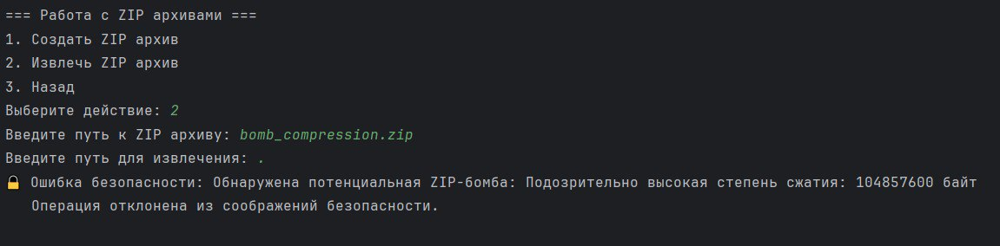

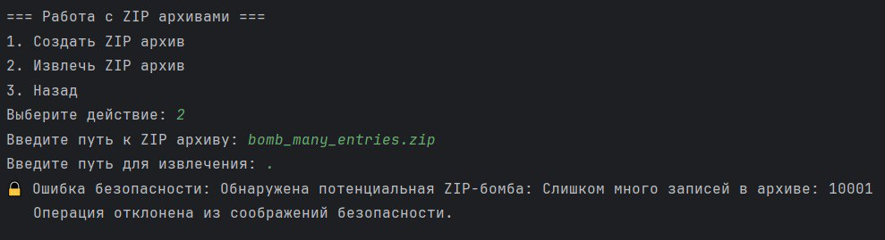


### 🎭 Защита от XML-атак

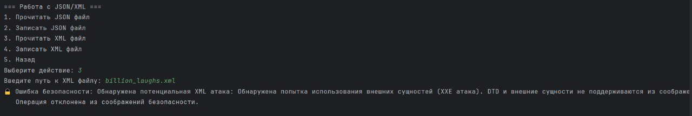

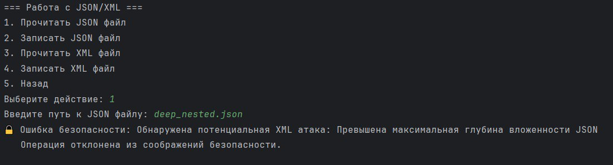

- ✅ Отключение поддержки внешних сущностей
- ✅ Отключение DTD
- ✅ Ограничение глубины вложенности (100 уровней)
- ✅ Защита от атак типа "Billion Laughs" через ограничение глубины вложенности и валидацию структуры XML.

### 🔐 Дополнительные меры безопасности

- **File Locking** — защита от race conditions при одновременном доступе
- **Проверка размера файлов** — ограничение максимального размера (100MB)
- **Хеширование паролей** — BCrypt для безопасного хранения паролей
- **Checksum файлов** — SHA-256 для проверки целостности
- **Аудит операций** — логирование всех действий пользователей

---

## 📦 Установка и запуск

### Требования

- ☕ **Java 17+**
- 🐘 **PostgreSQL 13+**
- 📦 **Maven 3.6+** (или Maven Wrapper)

### Шаг 1: Клонирование репозитория

```bash
git clone <repository-url>
cd FileManagerUniversity
```

### Шаг 2: Настройка базы данных

Создайте базу данных PostgreSQL:

```sql
CREATE DATABASE FileManager;
```

Таблицы будут созданы автоматически при первом запуске приложения (благодаря `ddl-auto=update`).

### Шаг 3: Настройка конфигурации

Отредактируйте файл `src/main/resources/application.properties`:

```properties
# Настройки подключения к БД
spring.datasource.url=jdbc:postgresql://localhost:5432/FileManager
spring.datasource.username=postgres
spring.datasource.password=ВАШ_ПАРОЛЬ

# Базовая директория для файлов
filemanager.base.directory=./files

# Максимальный размер файла (в байтах)
filemanager.max.file.size=104857600  # 100MB
```

### Шаг 4: Запуск приложения

**Вариант 1: Через Maven Wrapper (рекомендуется)**

```bash
# Linux/macOS
./mvnw spring-boot:run

# Windows
mvnw.cmd spring-boot:run
```

**Вариант 2: Через установленный Maven**

```bash
mvn spring-boot:run
```

**Вариант 3: Скомпилировать и запустить JAR**

```bash
mvn clean package
java -jar target/FileManagerUniversity-0.0.1-SNAPSHOT.jar
```

### Шаг 5: Использование

После запуска приложения откроется консольный интерфейс. Сначала зарегистрируйтесь или войдите в систему, затем используйте меню для работы с файлами.

---

## ⚙️ Конфигурация

### Основные параметры в `application.properties`

```properties
# База данных
spring.datasource.url=jdbc:postgresql://localhost:5432/FileManager
spring.datasource.username=postgres
spring.datasource.password=12345

# Hibernate
spring.jpa.hibernate.ddl-auto=update
spring.jpa.show-sql=true

# Файловый менеджер
filemanager.base.directory=./files                    # Базовая директория
filemanager.max.file.size=104857600                   # Макс. размер файла (100MB)
filemanager.zip.max.ratio=100                         # Макс. степень сжатия
filemanager.zip.max.uncompressed.size=1073741824      # Макс. размер распакованных данных (1GB)
```

### Переменные окружения

Вы также можете настроить приложение через переменные окружения:

```bash
export SPRING_DATASOURCE_URL=jdbc:postgresql://localhost:5432/FileManager
export SPRING_DATASOURCE_USERNAME=postgres
export SPRING_DATASOURCE_PASSWORD=your_password
export FILEMANAGER_BASE_DIRECTORY=./files
```

---

## 🗄️ Модель данных

### ERD диаграмма

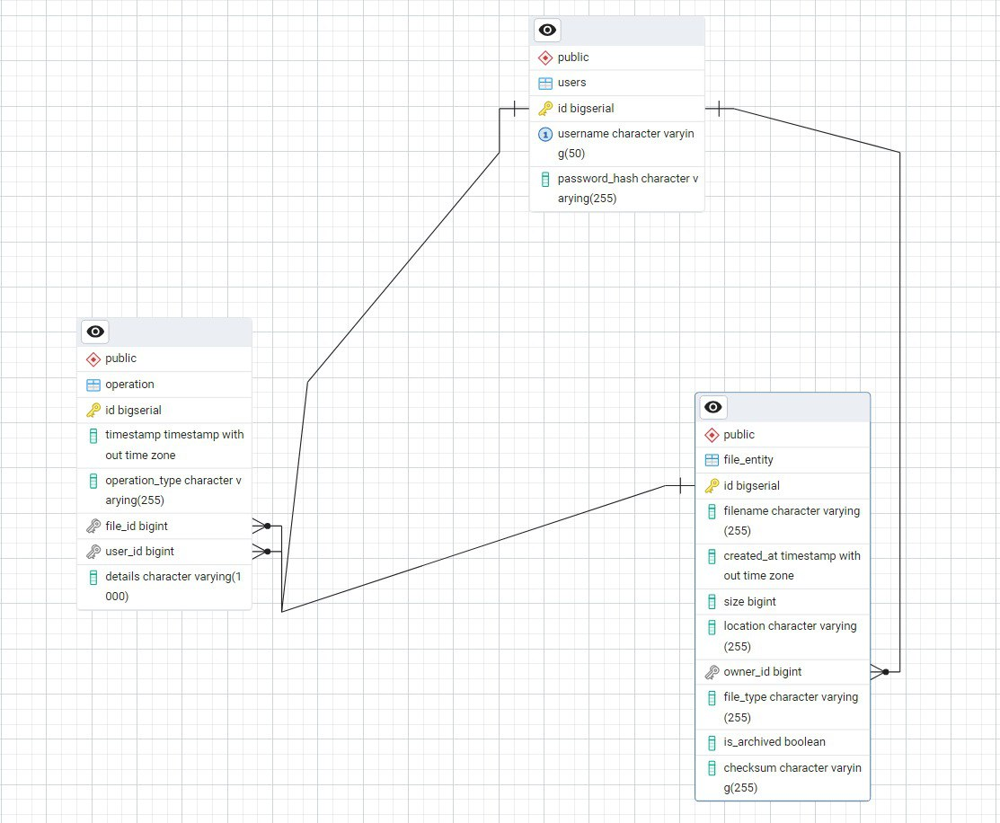

### Описание таблиц

#### `users` — Пользователи

| Поле | Тип | Описание |
|------|-----|----------|
| `id` | SERIAL | Первичный ключ |
| `username` | VARCHAR(50) | Уникальное имя пользователя |
| `password_hash` | VARCHAR(255) | Хеш пароля (BCrypt) |

#### `file_entity` — Файлы

| Поле | Тип | Описание |
|------|-----|----------|
| `id` | SERIAL | Первичный ключ |
| `filename` | VARCHAR(255) | Имя файла |
| `created_at` | TIMESTAMP | Дата создания |
| `size` | BIGINT | Размер файла в байтах |
| `location` | VARCHAR(255) | Полный путь к файлу |
| `owner_id` | BIGINT | Внешний ключ на `users.id` |
| `file_type` | VARCHAR(255) | Тип файла (расширение) |
| `is_archived` | BOOLEAN | Является ли файл архивом |
| `checksum` | VARCHAR(255) | SHA-256 хеш файла |

#### `operation` — Журнал аудита

| Поле | Тип | Описание |
|------|-----|----------|
| `id` | SERIAL | Первичный ключ |
| `timestamp` | TIMESTAMP | Время операции |
| `operation_type` | VARCHAR(50) | Тип операции (CREATE, READ, UPDATE, DELETE, etc.) |
| `file_id` | BIGINT | Внешний ключ на `file_entity.id` (nullable) |
| `user_id` | BIGINT | Внешний ключ на `users.id` |
| `details` | VARCHAR(1000) | Детали операции |

---

## 📚 Примеры использования

### Регистрация и вход

```
=== Безопасный файловый менеджер ===
Базовая директория: /path/to/files

1. Войти
2. Зарегистрироваться
Выберите действие: 2

Введите имя пользователя (3-50 символов): testuser
Введите пароль: ********
Регистрация успешна!
```

### Создание файла

```
=== Работа с файлами ===
1. Прочитать файл
2. Создать/Изменить файл
...
Выберите действие: 2

Введите путь к файлу: documents/test.txt
Введите содержимое файла:
Это содержимое моего файла.
Вторая строка.
[пустая строка для завершения]

✅ Файл успешно сохранен: documents/test.txt
```

### Просмотр информации о дисках

```
=== Информация о дисках ===

Диск: /
  Общий объем: 250.00 GB
  Свободно: 150.00 GB
  Использовано: 100.00 GB
  Использовано: 40.00%
```

---

## 🔍 Структура проекта

```
FileManagerUniversity/
├── src/
│   ├── main/
│   │   ├── java/com/sobolev/spring/filemanageruniversity/
│   │   │   ├── config/              # Конфигурация и константы
│   │   │   ├── console/             # Консольный интерфейс
│   │   │   ├── entity/              # JPA сущности
│   │   │   ├── exception/           # Кастомные исключения
│   │   │   ├── repository/          # JPA репозитории
│   │   │   ├── service/             # Бизнес-логика
│   │   │   ├── util/                # Утилиты
│   │   │   └── FileManagerUniversityApplication.java
│   │   └── resources/
│   │       ├── application.properties
│   │       └── init.sql
│   └── test/                        # Тесты
├── media/                           # Скриншоты и документация
├── pom.xml                          # Maven конфигурация
└── README.md                        # Документация
```

---

## 🧪 Тестирование безопасности

В проекте включены тестовые скрипты для проверки защиты от различных атак:

- `test_xml_attacks.py` — тесты XML-атак (XXE, Billion Laughs)
- `test_zip_bomb.py` — тесты ZIP-бомб
- `bomb_zip_generator.py` — генератор ZIP-бомб для тестирования

**⚠️ Внимание**: Эти скрипты предназначены только для тестирования системы безопасности!

---

## 📝 Лицензия

Этот проект создан в учебных целях для демонстрации принципов безопасной разработки.

---

## 👨‍💻 Автор

Разработано как учебный проект по безопасности файловых систем.

---

## 🙏 Благодарности

- Spring Boot team за отличный фреймворк
- Apache Commons за библиотеку для работы с архивами
- PostgreSQL team за надежную СУБД

---

<div align="center">

**⭐ Если проект был полезен, поставьте звезду! ⭐**

Made with ❤️ and ☕

</div>

